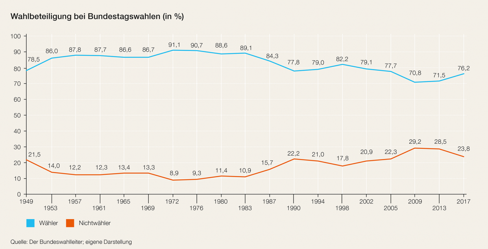
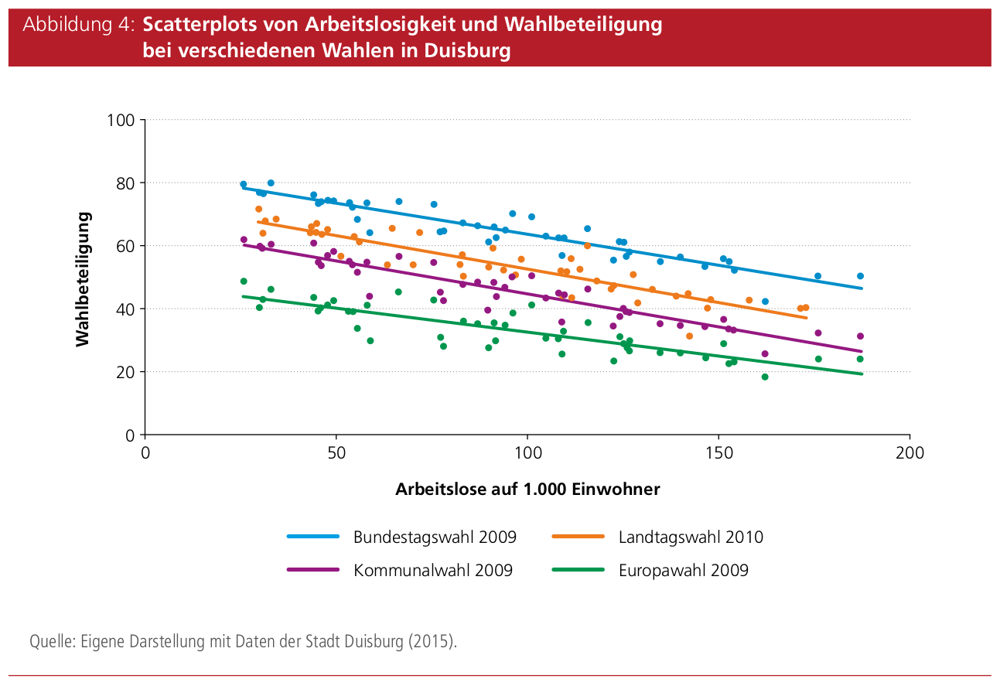

<!--
# Pläne
# Schöne Formatierungshilfen: www.bigbookofr.com/reports.html#pimp-my-rmd-a-few-tips-for-r-markdown
# zB der Footer ist eine schöne Idee!
#  
# Rssourcen
# Happy Gitr: https://happygitwithr.com/existing-github-first.html
# Translate Adresses into Lat/Long: https://www.latlong.net/convert-address-to-lat-long.html
# Display Geo-Spatial data: https://slcladal.github.io/maps.html
# 
-->

```{r libraries, echo=FALSE, message=FALSE, warning=FALSE}
options("scipen" = 100, "digits" = 2) # suppress math annotation

library(leaflet) # we need this to create interactive maps
library(sp) 
library(viridis)
library(tidyverse)
library(readr) 
library(splancs) # this is a package that finds the borders of a point cloud
library(broom) # we need this to translate the data from shape-files into ggplot()-readable data
library(rgdal) # we need this package to read shape-files
library(knitr) # we need this for making tables in the document using kables()
library(kableExtra) # we need this to format kable()-tables https://haozhu233.github.io/kableExtra/

```

**Version 0.9**

# Einleitung

Am 12.9.2021 wurde in der Stadt Verden (Aller) die letzte Wahl zum Stadtrat abgehalten. In diesem Dokument werden frei verfügbare Daten zu dieser Wahl ausgewertet. Es startet mit einer Übersicht über Wahlbeteiligung und Briefwahl und geht dann über zur Analyse des Wahlergebnis der Verdener Grünen. Am Ende folgen einige persönliche und damit höchst subjektive Interpretationen. Diese sollten als Anregungen und Diskussionsanreize z.B. für die AG Demokratie stärken und darüber hinaus gelesen werden. 

Kritik, Rückfragen und Anregungen gehen bitte an [Werner Reichmann](mailto:w.reichmann@gruene-verden-aller.de){.email}.


```{r Create Data Frames, echo=FALSE, warning=FALSE, message=FALSE}
# In this chunk I create 3 dataframes:
# 1. "verden_border_ll" includes the data for the vorders of Verden (Aller) in lat/long-format
# 2. "wahlbezirke" beinhaltet die Daten der Koordinaten aller Adressen und den dazugehörigen Wahlbezirknummern
# 3. "wahlergebnisse" beinhaltet die Daten der Wahlen
# 4. "wahl21" ist der Datensatz der 1 und 2 verbindet

# 1. Create a dataframe with data of the borders of Verden
# Read and transform the borders of Verden
# As it takes long to create this dataset and the packages make several problemsI did it one time using this code:
# germany_gemeindegrenzen <- readOGR(
#   dsn="data/shp_file/VG250_GEM_2021.shp",
#   verbose=FALSE)
# verden_border_ll <- spTransform(germany_gemeindegrenzen, CRS("+proj=longlat +ellps=GRS80"))
# verden_border_ll <- tidy(verden_border_ll, region = "GEN")
# verden_border_ll <- verden_border_ll %>% filter(id == "Verden (Aller)")
# remove(germany_gemeindegrenzen)
#
# I saved it and import it now. Thats much faster.
# write.csv(verden_border_ll, "data/verden_border_ll.csv", row.names = FALSE)
verden_border_ll <- read_csv("data/verden_border_ll.csv")
# --------------------------------------


# 2. Create dataset with long and lat-data of every address within Verden (Aller) 
# including every addresses' Wahlbezirknummer
wahlbezirke <- read_csv("data/verden_wahl_2021_wahlbezirke.csv",
                col_types = cols(Strasse = col_skip(), Hnr = col_skip(), long = col_character(),
                                 lat = col_character(), Alphateil = col_skip(),
                                 Zusatz = col_skip(),
                                 WahlbezirkName = col_skip(), WahlraumAnschriftStr = col_skip()),
                locale = locale(encoding = "ISO-8859-1"))


# R doesn't know adresses but coordinates of every address so I geocoded every address to a lat-long-coordination system
# unfortunately the geocoding did't work properly
# (1) I have to transform the variables lat and long from a unreadable string to a readable double-format (not very elegant)
long_new <- substr(wahlbezirke$long,1,8)
long_new <- paste(substr(long_new,1,1), ".", substr(long_new, 2, nchar(long_new)), sep ="")
long <- as.numeric(long_new)

lat_new <- substr(wahlbezirke$lat,1,7)
lat_new <- paste(substr(lat_new,1,2), ".", substr(lat_new, 3, nchar(lat_new)), sep ="")
lat <- as.numeric(lat_new)

wahlbezirke <- data.frame(long, lat, wahlbezirke$WahlbezirkNr)

wahlbezirke <- wahlbezirke %>% 
                  rename(wahlbezirksnummer = wahlbezirke.WahlbezirkNr)

remove(lat, long, lat_new, long_new)
# --------------------------------------


# 3. Create dataset including the election results
# Import and clean the dataset
wahlergebnisse <- read_delim("data/verden_wahl_2021_stadrat_ergebnisse.csv",
                               delim = ";", 
                               escape_double = FALSE, 
                               col_types = cols(datum = col_skip(),
                                                wahl = col_skip(), 
                                                ags = col_skip(), 
                                                `max-schnellmeldungen` = col_skip(), 
                                                `anz-schnellmeldungen` = col_skip(), 
                                                A3 = col_skip()), 
                               locale = locale(), 
                               trim_ws = TRUE)
  
wahlergebnisse <- wahlergebnisse %>%
    rename(
      wahlbezirksnummer = "gebiet-nr",
      Praesenzwähler = A1,
      Briefwähler = A2,
      Wahlberechtigte = A,
      Waehler = B,
      Ungueltige_Stimmzettel = C1,
      Gueltige_Stimmzettel = C2,
      Gueltige_Stimmen = D,
      Gruene_Listenstimmen = D3_liste,
      Gruene_Kandidatenstimmen = D3_summe_kandidaten,
      Gruene_Alle_Stimmen = D3_summe_liste_kandidaten,
      Johanna = D3_1,
      Rasmus = D3_2,
      Janina = D3_3,
      Sven = D3_4,
      Baerbel = D3_5,
      Werner = D3_6,
      Annette = D3_7,
      Matthias = D3_8,
      Alina = D3_9,
      Reinhard = D3_10,
      Hannelore = D3_11,
      Philipp = D3_12,
      Doris = D3_13,
      Gerd = D3_14,
      Karin = D3_15,
      Ulrich = D3_16,
      Uwe = D3_17
)

# wahlergebnisse[11:81] <- list(NULL)
# wahlergebnisse[31:100] <- list(NULL)

wahlergebnisse$wahlbeteiligung <-100/wahlergebnisse$Wahlberechtigte*wahlergebnisse$Waehler

wahlergebnisse$gruener_anteil <- 100/wahlergebnisse$Gueltige_Stimmen*wahlergebnisse$Gruene_Alle_Stimmen

wahlergebnisse$briefwahl_anteil <- 100/wahlergebnisse$Wahlberechtigte*wahlergebnisse$Briefwähler

wahl21 <- merge(wahlbezirke, wahlergebnisse[1:28,], by = "wahlbezirksnummer", all=TRUE)
```

# Wahlbeteiligung & Briefwahl

Bei der Stadtratswahl 2021 waren `r sum(wahlergebnisse$Wahlberechtigte)` Menschen wahlberechtigt. Es wurden `r sum(wahlergebnisse$Gueltige_Stimmzettel)` gültige Stimmzettel abgegeben. Das ergibt eine Wahlbeteiligung über das gesamte Stadtgebiet von `r 100/sum(wahlergebnisse$Wahlberechtigte)*sum(wahlergebnisse$Gueltige_Stimmzettel)`%. Das bedeutet, dass sich `r sum(wahlergebnisse$Wahlberechtigte)-sum(wahlergebnisse$Gueltige_Stimmzettel)` Menschen **nicht** an der Wahl beteiligt haben.

Die Stadt Verden (Aller) ist in 28 physische Wahlbezirke und 14 Briefwahlbezirke unterteilt. Jede Adresse ist genau einem Wahlbezirk zugeordnet. Diese Bezirke sind allerdings keine einheitlichen Flächen sondern überschneiden sich teilweise oder sind historisch gewachsen und sind daher (so wie in Eitze) ziemlich durcheinander. Leider enthalten die Daten keine Angaben über die Wahlberechtigten in den Briefwahlbezirken. Daher kann die Wahlbeteiligung der BriefwählerInnen nicht berechnet werden.

In den Wahlbezirken ist die Wahlbeteiligung unterschiedlich. Sie schwankt zwischen `r min(wahlergebnisse[1:28,]$wahlbeteiligung)`% und `r max(wahlergebnisse[1:28,]$wahlbeteiligung)`% (**ohne Briefwahlstimmen, daher die Differenz zur gesamten Wahlbeteiligung**). Die folgende Karte zeigt die Wahlbeteiligung in den einzelnen Wahlbezirken.

```{r Karte Wahlbeteiligung, echo=FALSE, message = FALSE, out.width="100%"}
pal <- colorNumeric(
  palette = "Greens", 
  domain = wahl21$wahlbeteiligung)

leaflet(data = wahl21) %>% 
  addTiles() %>%
  addProviderTiles(providers$CartoDB.Positron) %>%
  addPolygons(
    verden_border_ll$long, 
    verden_border_ll$lat, 
    color = "black", 
    weight = 5, 
    fillOpacity = 0.00001) %>%
  addCircleMarkers(
    radius = 5,
    fillColor = ~pal(wahl21$wahlbeteiligung),
    stroke=FALSE,
    fillOpacity = 0.9) %>%
  addLegend("bottomright", pal = pal, values = ~wahl21$wahlbeteiligung,
            title = "Wahlbeteiligung (o. Briefwahl)",
            labFormat = labelFormat(suffix = "%"),
            opacity = 1
  )

```

Es zeigt sich, dass die Beteiligung der PräsenzwählerInnen in den alten Dorfzentren am höchsten ist und mit Nähe zur Kernstadt sinkt.

Der Anteil derjenigen, die als BriefwählerInnen wahlberechtigt an allen WählerInnen sind, beträgt `r 100/sum(wahlergebnisse$Waehler)*sum(wahlergebnisse$Briefwähler)`%. Die Grünen haben `r sum(wahlergebnisse[29:42,]$Gruene_Alle_Stimmen)` Stimmen über die Briefwahl bekommen. Das sind `r 100/sum(wahlergebnisse$Gruene_Alle_Stimmen)*sum(wahlergebnisse[29:42,]$Gruene_Alle_Stimmen)`% aller Stimmen für die Grünen.

Der Anteil an Briefwahlstimmen an allen Stimmen verteilt sich räumlich wie folgt:

```{r Karte Briefwahlbeteiligung, echo=FALSE, message = FALSE, out.width="100%"}
pal <- colorNumeric(
  palette = "Greens", 
  domain = wahl21$briefwahl_anteil)

leaflet(data = wahl21) %>% 
  addTiles() %>%
  addProviderTiles(providers$CartoDB.Positron) %>%
  addPolygons(
    verden_border_ll$long, 
    verden_border_ll$lat, 
    color = "black", 
    weight = 5, 
    fillOpacity = 0.00001) %>%
  addCircleMarkers(
    radius = 5,
    fillColor = ~pal(wahl21$briefwahl_anteil),
    stroke=FALSE,
    fillOpacity = 0.9) %>%
  addLegend("bottomright", pal = pal, values = ~wahl21$briefwahl_anteil,
            title = "Anteil Briefwahl",
            labFormat = labelFormat(suffix = "%"),
            opacity = 1
  )

```

Der Anteil der BriefwählerInnen ist in der Kernstadt am höchsten und in den alten Dorfzentren am niedrigsten.

Die Parteien bekamen unterschiedlich viele Briefwahlstimmen:

```{r Tabelle Briefwähler x Listen, echo = FALSE}

parteien = c("CDU", "SPD", "FDP", "Grüne")
anteile  = c(100/sum(wahlergebnisse$D1_summe_liste_kandidaten)*sum(wahlergebnisse[29:42,]$D1_summe_liste_kandidaten), 
             100/sum(wahlergebnisse$D2_summe_liste_kandidaten)*sum(wahlergebnisse[29:42,]$D2_summe_liste_kandidaten),
             100/sum(wahlergebnisse$D5_summe_liste_kandidaten)*sum(wahlergebnisse[29:42,]$D5_summe_liste_kandidaten),
             100/sum(wahlergebnisse$Gruene_Alle_Stimmen)*sum(wahlergebnisse[29:42,]$Gruene_Alle_Stimmen))

df_temp <- data.frame(parteien, anteile)
df_temp <- df_temp[order(df_temp$anteile, decreasing = FALSE),]
df_temp %>%
  kbl(col.names = c("Parteien", "%"), 
      digits = 2, 
      caption = "Anteile der Briefwahlstimmen über die Parteien") %>%
  kable_styling(bootstrap_options = c("hover"), 
                full_width = F, 
                position = "center")
remove(df_temp)

```

Wie auch im Bundestrend haben die Grünen in Verden auf kommunaler Ebene den größten Anteil an BriefwählerInnen.

# Grüne WählerInnen in Verden

Alle Wahlberechtigten hatten 3 Stimmen zu vergeben. Die Stimmen konnten beliebig über die Listen und Personen verteilt werden. Die Grünen haben bei der Kommunalwahl 2021 insgesamt `r sum(wahlergebnisse$Gruene_Alle_Stimmen)` Stimmen bekommen, das sind `r 100/sum(wahlergebnisse$Gueltige_Stimmen)*sum(wahlergebnisse$Gruene_Alle_Stimmen)`% aller gültigen Stimmen.

Im Vergleich zu den drei Wahlen davor ist das das beste Wahlergebnis:

```{r Tabelle Grüner Anteil über die Jahre, echo=FALSE}
ergebnis2006 <- c(33.8, 38.5, 12.3, 9.2)
ergebnis2011 <- c(35.1, 43.4, 4.9, 12.9)
ergebnis2016 <- c(35.2, 35.3, 8.9, 11.1)
ergebnis2021 <- c(33.1, 29.7, 11.3, 19.2)

df_temp <- data.frame(parteien, ergebnis2016, ergebnis2011, ergebnis2006, ergebnis2021)

df_temp %>%
  kbl(col.names = c("Parteien", "2006", "2011", "2016", "2021"),
      caption = "Stadtratswahlergebnisse",
      align = "lcccc",
      digits = c(0,0,0,0)) %>%
  kable_styling(bootstrap_options = c("hover"), 
                full_width = F, 
                position = "center")

remove(df_temp, ergebnis2006, ergebnis2011, ergebnis2016, ergebnis2021)

```


Die Anzahl der Menschen, die die Grünen gewählt haben, lässt sich nicht exakt bestimmen. Unter der Annahme, dass alle, die die Grünen gewählt haben, kumuliert haben, gab es `r sum(wahlergebnisse$Gruene_Alle_Stimmen)/3` GrünwählerInnen. Das ist aber nicht sehr wahrscheinlich, da sicher auch viele panaschiert (also ihre Stimmen über die Listen verteilt) haben. Im Maximalfall gab es so viele WählerInnen wie Stimmen - die Anzahl der GrünwählerInnen bewegt sich also zwischen `r sum(wahlergebnisse$Gruene_Alle_Stimmen)/3` und `r sum(wahlergebnisse$Gruene_Alle_Stimmen)`.

Die Gesamtstimmenanzahl der Grünen setzt sich aus `r sum(wahlergebnisse$Gruene_Listenstimmen)` Stimmen für die Liste und `r sum(wahlergebnisse$Gruene_Kandidatenstimmen)` Stimmen für Personen zusammen.

Die einzelnen KandidatInnen waren beim Sammeln von Erststimmen sehr unterschiedlich erfolgreich.

```{r Tabelle Erststimmen, echo=FALSE}
kandidaten = c("Johanna", "Rasmus", "Janina", "Sven", "Baerbel", "Werner", "Annette", "Matthias", "Alina", "Reinhard", "Hannelore", "Philipp", "Doris", "Gerd", "Karin", "Ulrich", "Uwe")
kandidaten_stimmen = c(sum(wahlergebnisse$Johanna),
                       sum(wahlergebnisse$Rasmus),
                       sum(wahlergebnisse$Janina),
                       sum(wahlergebnisse$Sven),
                       sum(wahlergebnisse$Baerbel),
                       sum(wahlergebnisse$Werner),
                       sum(wahlergebnisse$Annette),
                       sum(wahlergebnisse$Matthias),
                       sum(wahlergebnisse$Alina),
                       sum(wahlergebnisse$Reinhard),
                       sum(wahlergebnisse$Hannelore),
                       sum(wahlergebnisse$Philipp),
                       sum(wahlergebnisse$Doris),
                       sum(wahlergebnisse$Gerd),
                       sum(wahlergebnisse$Karin),
                       sum(wahlergebnisse$Ulrich),
                       sum(wahlergebnisse$Uwe)
                           )
df_temp <- data.frame(kandidaten, kandidaten_stimmen)

kbl(df_temp[order(df_temp$kandidaten_stimmen, decreasing = TRUE),], 
    col.names = c("KandidatInnen", "Stimmen (n)"), 
    caption = "Erststimmen der Grünen KandidatInnen, absteigend geordnet") %>%
 kable_styling(bootstrap_options = c("hover"), 
                full_width = F, 
                position = "center")


remove(df_temp, kandidaten, kandidaten_stimmen)
```


## Wo wohnen die GrünwählerInnen?

Über die Daten kann man auch herausfinden, in welchem der Wahlgebiete der Anteil der Grünen Stimmen an allen gültigen Stimmen am höchsten ist, also wo die GrünwählerInnen wohnen. Allerdings sind die Briefwahlstimmen hier nicht dabei, was das Ergebnis ein wenig verzerrt.

```{r Karte Grüne Anteil, echo=FALSE, message = FALSE, out.width="100%"}
pal <- colorNumeric(
  palette = "Greens", 
  domain = wahl21$gruener_anteil)

leaflet(data = wahl21) %>% 
  addTiles() %>%
  addProviderTiles(providers$CartoDB.Positron) %>%
  addPolygons(
    verden_border_ll$long, 
    verden_border_ll$lat, 
    color = "black", 
    weight = 5, 
    fillOpacity = 0.00001) %>%
  addCircleMarkers(
    radius = 5,
    fillColor = ~pal(wahl21$gruener_anteil),
    stroke=FALSE,
    fillOpacity = 0.9) %>%
  addLegend("bottomright", pal = pal, values = ~wahl21$gruener_anteil,
            title = "Anteil Grüner Stimmen",
            labFormat = labelFormat(suffix = "%"),
            opacity = 1
  )

```

Die Unterschiede sind erheblich. In Walle, Scharnhorst, Döhlbergen, Rieda sowie rund um die Straße Trift ist der Anteil der GrünwählerInnen am geringsten. Dieses Ergebnis sollten wir uns für das Kapitel "Wissenswertes übers Nichtwählen" merken.

Die Hochburgen sind dagegen die Kernstadt, Burgberg, Borstel und Nemühlen. Aber auch in Hutbergen stehen die Grünen nicht ganz gut da.

# Anknüpfungspunkte & Interpretationen

Die Tatsache, dass es bei der Kommunalwahl mindestens `r sum(wahlergebnisse$Gruene_Alle_Stimmen)/3` Menschen gab, die den Grünen zu mindest eine Stimme gegeben haben (wahrscheinlich gab es aber mehr davon) ist erstaunlich, wenn man bedenkt, dass die Anzahl der aktiven Grünen in Verden bei ca. 20-30 Personen steht. Da könnte es ein großes Potenzial an Menschen geben, die für die kommunalpolitische Arbeit begeisterbar wären. Was sind die Motive, die Grünen zu wählen, aber keinerlei öffentliche grüne Aktivitäten zu setzen? 

Es ist ein bundesweites Phänomen, dass der Anteil der Briefwahlstimmen steigt. Was bedeutet es für die Fragestellungen unserer AG, dass immer mehr Menschen nicht vor Ort wählen wollen oder können und sich statt dessen für die Briefwahl entscheiden? Und warum haben die Grünen den höchsten Anteil an Briefwahlstimmen unter allen Parteien?

Die Liste der Erststimmen zeigt eigentlich wenig Überraschendes, aber doch einiges Erwähnenswertes: 

- Wer schon länger in der Politik ist oder war oder vielleicht durch Beruf viele Leute kennt (Johanna, Rasmus, Bärbel, Uwe, Hanne) bekommt viele Stimmen.
- Die hohe Erststimmenanzahl für Alina zeigt, dass WählerInnen gerne bereit sind, jüngeren und weniger etablierten Menschen ihre Stimme zu geben. Die strukturellen Hürden für Jüngere und Frauen in die Kommunalpolitik einzusteigen, sind also weniger in der Grünen Wahlkabine zu suchen, sondern woanders - aber wo??? Weitere Analyseidee: Auswerten, ob jüngere Frauen auch in den anderen Listen große Zustimmung erfahren haben, oder ob das ein "Grünes Phänomen" ist.
- Menschen, die weder in Verden ihre Ausbildung genossen haben, noch beruflich hier verankert waren/sind, noch dazu Ausländer sind und sich bis dato vor Ort nicht öffentlich engagiert haben (Werner), bekommen eher weniger Erststimmen. Das ist auch wenig erstaunlich.

Wenn wir uns auch um jene Stadtteile kümmern wollen, wo der Anteil von GrünwählerInnen gering ist, müssten wir nach Scharnhorst, Döhlbergen/Rieda sowie nach Walle gehen. Woran liegt der geringe Anteil der Grünen Stimmen in diesen Ortsteilen? Vielleicht an der stärkeren landwirtschafltichen Prägung? Was ist in Walle los? Entgegen einer landläufigen Ansicht sind die Grünen in Verden nicht nur eine Partei von GutverdienerInnen sondern auch von Nicht-LandwirtInnen.

# Wissenswertes übers Nichtwählen
Im Zuge unserer Diskussion kam die Frage auf, was die Motivation fürs Nichtwählen ist und ob wir etwas über die Sozialstruktur von NichtwählerInnen herausfinden können. Es existieren natürlich keine Studien, die das Nichtwählen in Verden untersuchen. Aber insbesondere aus der Politikwissenschaft gibt es einige Erkenntnisse, die auch in Verden gültig sein können.

Grundsätzlich sinkt die Wahlbeteiligung auf allen föderalen Ebenen seit den 1970er-Jahren. Bei der Bundestagswahl 1972 gaben 91,1% der Wahlberechtigten ihre Stimme ab. Bei der Bundestagswahl 2009 war die Wahlbeteiligung bei der Bundestagswahl so niedrig wie vorher und nachher nie wieder.


Quelle: https://www.bpb.de/themen/politisches-system/wahlen-in-deutschland/335666/wahlbeteiligung-nichtwaehler-und-protestwaehlerschaft/


Nicht alle sehen eine niedrige Wahlbeteiligung problematisch an sondern sehen sie als "Normalisierung" und "Anpassung" an andere Länder mit langer demokratischer Tradition. Andere sehen die hohe Wahlbeteiliung in den 1970er-Jahren als die Ausnahme. International vergleichende Studien zeigen, dass die Wahlbeteiligung in Deutschland nicht außergewöhnlich stark abgenommen hat sondern durchaus im internationalen Trend liegt.

Ob eine Wahlbeteiligung von `r 100/sum(wahlergebnisse$Wahlberechtigte)*sum(wahlergebnisse$Gueltige_Stimmzettel)`%, wie bei der letzten Kommunalwahl in Verden  tatsächlich kein Grund zur Sorge sein soll, darf aus repräsentationstheoretischen Gründen bezweifelt werden.

## Motivation 
Es gibt es keine einheitliche und gleichsam "geschlossene" Partei der NichtwählerInnen. Die Motive, nicht zur Wahl zu gehen, sind sehr unterschiedlich. Trotzdem gibt es einige auffällige Regelmäßigkeiten.


### Zufriedenheit
Warum wählen Menschen nicht? Hier gibt es eine interessante These: "Zufriedenheit", verstanden als Konvolut aus Zufriedenheit mit dem politischen, dem wirtschaftlichen und Parteiensystem sowie mit der Verteilungen von materiellen und immateriellen Gütern, sei die entscheidende Variable, die über die Wahlbeteiliung entscheidet. Dabei gehen diejenigen die wenig und diejenigen, die sehr zufrieden sind, nicht zu Wahl. Nur die, die auf der Zufriedenheitsdimension sozusagen in der Mitte liegen, geben ihre Stimmen ab.

Was als Un/Zufriedenheit zu verstehen ist, lässt sich noch genauer beschreiben als bisher geschehen. 

* Die Un/Zufriedenheit mit der wirtschaftlichen Lage der Menschen schlägt besonders deutlich auf das Nichtwählen durch. Empirische Studien zeigen, dass die Wahlabsicht bei Menschen mit dem Einkommen und dem Bildungsabschluss sinkt. Krass daran ist, dass es in den 1970er Jahren diesen Unterschied bei der Wahlbeteiligung zwischen Menschen mit hohem und niedrigem Einkommen noch nicht gab. Während über die Jahre die Wahlbeteiligung der "Reichen" gleich blieb, ist die der "Armen" kontinuierlich gesunken.
Da das Einkommen auch einen räumlichen Aspekt hat, d.h. Menschen ähnlicher Einkommensschichten ähnliche Wohnorte wählen, entstehen Stadtviertel in denen die Wahlbeteiligung seit den 1970er Jahren gesunken ist und solche, wo sie gleich geblieben ist. Doch auch das war nicht immer so! 

> "Für Bremen liegen Daten zur Wahlbeteiligung in einzelnen Stadtteilen für fast vier Jahrzehnte vor. 1972 betrug der Unterschied zwischen der höchsten und der niedrigsten Wahlbeteiligung zehn Prozentpunkte. Seitdem ist der Abstand immer größer geworden. Bei der Bundestagswahl 2009 waren es 35 Prozentpunkte." (Schäfer 2010)

Es gibt also eine sich über Zeit zunehmend öffnende Schere zwischen wirtschaftlich besser Gestellten, die wählen gehen und ärmeren Gruppen, die nicht mehr wählen gehen.

* Die Unzufriedenheit mit Parteien bezieht sich darauf, dass NichtwählerInnen stärker meinen, dass sie von keiner Partei repräsentiert werden oder, dass Parteien zu großen Einfluss haben. Außerdem gibt es Menschen mit enger Parteibindung, die aber von ihrer Partei enttäuscht sind und dann nicht zur Wahl gehen.

### Individualisierung & Wertewandel
Eine weiterer Grund für die sinkende Wahlbeteiligung wird im allgemeinen Trend der Individualisierung und dem damit verbundenen Wertewandel gesehen. Die Deutschen hätten ihre "Untertanenmentalität" der 1950er-Jahre hinter sich gelassen, alte Werte hätten an Bedeutung verloren. Dieser Wertewandel beeinflusst auch das Wahlverhalten. Die bürgerliche "Pflicht" zur Wahl wird von individuellen Entscheidungen abgelöst. Dabei sind Nichtwahl, Protestwahl und (zufällige, kurzfristige) Parteienwechsel akzeptierte Alternativen.

## Sozialstruktur

> Bildung gilt weltweit auf allen Wahlebenen als starker Indikator für die Wahlteilnahme. Er zeigt in den meisten Fällen signifikante Auswirkungen auf die Wahlbeteiligung. (Kaeding & Haußner 2016)

Oben wurden schon einige sozialstrukturelle Unterschiede, die die Un/Zufriedenheit und damit die Wahlbeteiligung beeinflussen erwähnt. Es gibt noch weitere Merkmale, die wichtig sind, hier vor allem das Alter, die Bildung und das Einkommen.

> "Jüngere bleiben besonders häufig der Wahlurne fern: Bei der Bundestagswahl 2009 gaben nur 60 Prozent der unter 30-Jährigen ihre Stimme ab, während 80 Prozent der Wähler zwischen 60 und 70 Jahren gewählt haben. Doch diese allgemeine Aussage verdeckt Unterschiede. Aus Umfragen wissen wir, dass in allen Altersgruppen höher Gebildete häufiger angeben, gewählt zu haben. Den größten Einfluss auf die Wahlteilnahme hat der Bildungsgrad allerdings bei den Jüngeren. Abiturienten zeigen auch heute noch eine hohe Bereitschaft, zu wählen, während sie bei jungen Leuten ohne Schulabschluss oder mit Hauptschulabschluss deutlich niedriger liegt." (Schäfer 2010)

Es zeigt sich also, dass das Alter nicht unbedingt die entscheidende Einflussgröße ist sondern der Bildungsgrad stärker durchschlägt.

Weitere Einflussfaktoren können wie folgt zusammengefasst werden: In Stadtvierteln, wo die Wahlbeteiligung niedrig ist, ist der Anteil von alleinerziehenden Frauen 2x so hoch, der Anteil an Migranten 3x so hoch, die Arbeitslosenquote 4x so hoch, der Anteil an Bedarfsgemeinschaften 5x so hoch und die Anzahl öffentlich geförderter Wohnungen gar 10x so hoch. 
Ich denke, man kann davon ausgehen, dass die Menschen in diesen Vierteln grundsätzlich unzufriedener sind (siehe oben). Insbesondere wenn wir das Phänomen der "relativen Deprivation" berücksichtigen, d.h. dass sich Menschen eher mit wahrnehmbaren Bezugsgruppen vergleichen und nicht ihre "objektive Lage" beurteilen. Armin Schäfer dazu: "Inzwischen wissen wir, dass Unzufriedenheit häufig zu Apathie und dem Verzicht auf politische Teilhabe, nicht aber zu Protest führt."

Die Auswirkung von Arbeitslosigkeit auf die Wahlbeteiligung reiht sich in diese Ergebnisse. Die folgende Grafik zeigt, dass die die Wahlbeteiligung sinkt, wenn der Anteil von Arbeitslosen an der gesamten Wohnbevölkerung steigt. Für die GRafik wurden beispielhaft Daten aus Viertel Duisburgs verwendet.


Quelle: Kaeding & Haußner 2016, S.10

**Fazit: Es gibt eine soziale Schieflage der Wahlbeteiligung**


## Sozialstruktur und Wahlbeteiligung in Verden

Nach allem, was ich über Verden weiß, ist es eine vergleichsweise reiche Stadt. Die Gewerbesteuereinnahmen sind im Niedersachsenvergleich sehr hoch, was auf eine agile Wirtschaftsstruktur hindeutet. Die Stadt hat keine Schulden, was darauf hindeutet, dass diese Wirtschaftsstruktur schon lange agil und daher strukturell verfestigt und stabil ist. Der Arbeitsmarkt ist hervorragend, die Arbeitslosigkeit ist im September 2022 um 0,3 Punkte auf 4,0% gesunken, die VWL spricht in solchen Fällen bereits von Vollbeschäftigung.

Trotz dieser sehr positiven wirtschaftlichen Lage, gibt es auch in Verden soziale Unterschiede. Spiegeln sich diese auch in hier in der Wahlbeteiligung wider?

An die tatsächliche Wahlbeteiligung in den einzelnen Wahlgebieten kann man sich mit den vorhandenen Daten nur annähern (da, wie oben beschreiben, die Anzahl der wahlberechtigten BriefwählerInnen in den Wahlgebieten fehlt). Man kann aber jene Gebiete identifizieren, in denen sowohl die **Wahlbeteiligung (ohne Briefwahlstimmen)** als auch der **Anteil der BriefwählerInnen an allen WählerInnen** niedrig ist. Um diese leichter zu identifizieren, habe ich einen relativen Index erstellt, der beide Informationen kombiniert und sich zwischen 0 und 1 bewegt: 0 = niedrige Wahlbeteiligung in Verden, 1 = höchste Wahlbeteiligung in Verden.

Die folgende Tabelle zeigt die Wahlgebiete geordnet nach dem neuen Wahlbeteiligungsindex.

```{r Tabelle Wahlbeteiligung nach Wahlgebiet, echo=FALSE, message=FALSE}

wahlbeteiligung_gebiete <- data.frame(wahlergebnisse$`gebiet-name`[1:28], wahlergebnisse$wahlbeteiligung[1:28], wahlergebnisse$briefwahl_anteil[1:28])

wahlbeteiligung_gebiete$wbi <- wahlbeteiligung_gebiete$wahlergebnisse.wahlbeteiligung.1.28. + wahlbeteiligung_gebiete$wahlergebnisse.briefwahl_anteil.1.28.

wahlbeteiligung_gebiete$wbi <- wahlbeteiligung_gebiete$wbi - min(wahlbeteiligung_gebiete$wbi)

wahlbeteiligung_gebiete$wbi <- wahlbeteiligung_gebiete$wbi / max(wahlbeteiligung_gebiete$wbi)


wahlbeteiligung_gebiete <- wahlbeteiligung_gebiete[order(wahlbeteiligung_gebiete$wbi, decreasing = FALSE),]

wahlbeteiligung_gebiete %>%
  kbl(col.names = c("Wahlgebiete", "Wahlbeteiligung ohne Briefwahlstimmen (%)", "Anteil BriefwählerInnen (%)", "Wahlbeteiligungsindex"),
      caption = "Versuch einer Annäherung an die Wahlbeteiligung in den einzelnen Wahlgebieten",
      align = "lccc",
      digits = c(2,2,3)) %>%
  kable_styling(bootstrap_options = c("hover"), 
                full_width = F, 
                position = "center")

```

Interpretationsvorschläge & informierte Spekulationen:

* Es gibt Wahlgebiete, die die niedrige Präsenzwahlbeteiligung durch einen hohen Anteil an Briefwahlstimmen etwas ausgleichen. Beispiele: Rathaus, Grundschule am Sachsenhain II (das ist im Wesentlichen Neumühlen).

* Die Gebiete mit hohem Wahlbeteiligungsindex sind entweder alte Dorfkerne (Scharnhorst, Hönisch, Döhlbergen, Eissel, Eitze, Dauelsen, Walle, Borstel) oder innenstadtnahe Bereiche (Pestalozzischule I und II). Vielleicht ist die Sozialstruktur in diesen Bereichen noch "traditioneller", jedenfalls wohnen da nicht die sozial Schwachen, Anteil an MigrantInnen ist gering, die Einfamilienhausdichte ist hoch. "Alte Werte" werden da vielleicht noch hoch gehalten.

* Da uns keine kleinteiligen Sozialstrukturdaten für Verden vorliegen, haben wir in der Gruppe in guter und langjähriger Kenntnis unserer Stadt darüber spekuliert, wo in Verden sozial schwache Menschen wohnen. Drei Adressen sind bei diesem Brainstorming genannt worden: Neißestraße, Niedersachsenring und Am schwarzen Berg/Salzstraße. AnwohnerInnen der Neißestraße wählen im Gebiet "Kindertagesstätte Neißestraße", AnwohnerInnen des Niedersachsenrings im Gebiet "Grundschule am Lönsweg II", AnwohnerInnen am Meldauerberg wählen im Gebiet "Oberschule (Am Meldauer Berg) I" und AnwohnerInnen der Salzstraße wählen im Gebiet "Kindertagesstätte Carl-Hesse-Straße". Alle vier Wahlgebiete weisen unterdurchschnittliche Werte des Wahlbeteiligunsindex auf. 

* Dieses Ergebnis zeigt leider, dass sowohl die o.g. politikwissenschaftliche Erkenntisse auch auf Verden umlegbar sind: **Wahlbeteiligung ist eine soziale Frage**.

# Credits & Quellen {-}

Besten Dank an Frau Rein und Herrn Kämpfert von der Stadt Verden für die Kooperation bezüglich der Daten über die Verdener Wahlbezirke. 

Danke an Werner Meincke für die Wahlergebnisse aus den Jahren 2006, 2011 und 2016.

Die Daten über die Wahlergebnisse sind unter [den Wahlseiten der Stadt Verden](https://votemanager.kdo.de/20210912/03361012/praesentation/opendata.html) frei verfügbar.

Die Daten für die Landkarte kommen über [leaflet](http://www.leafletjs.com) aus der [OpenStreetMap.org](http://www.openstreetmap.org) abgerufen.

Die Daten der Stadtgrenze sind © GeoBasis-DE / [BKG](https://gdz.bkg.bund.de/index.php/default/verwaltungsgebiete-1-250-000-ebenen-stand-01-01-vg250-ebenen-01-01.html) 2021 und frei verfügbar.

Quellen fürs Kapitel "Wissenswertes übers Nichtwählen"

* Kaeding, Michael und Stefan Haußner. 2016. "Gut bekannt und unerreicht? Soziodemografisches Profil der Nichtwähler_innen." *Gutachten der Friedrich Ebert-Stiftung*

* "Arbeitslosigkeit sinkt im Kreis Verden trotz vieler Krisen", Verdener Aller Zeitung, 30.9.2022

* Korte, Karl-Rudolf. 2021. "Wahlbeteiligung: Nichtwähler- und Protestwählerschaft." *Bundeszentrale für politische Bildung*

* Korte, Karl-Rudolf. 2021. "Sozialstruktur und Milieus: Stammwählerschaft." *Bundeszentrale für politische Bildung*

* Schäfer, Armin. 2010. "Politische Parallelwelten. Wo die Nichtwähler wohnen." *Magazin Mitbestimmung*


Dieses Dokument wurde ausschließlich mit Open Source Software erzeugt: mit [R](https://www.r-project.org/), [RStudio](http://www.rstudio.org), [R Markdown](https://rmarkdown.rstudio.com) und [GNU](https://www.gnu.org)/[Linux](https://www.linuxfoundation.org/) [Ubuntu 20.04](https://www.ubuntu.com/). Sein Sourcecode ist auf meinem [github](http://www.github.com/soziologikus/) frei verfügbar.
